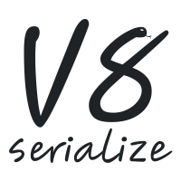

  

<em>Imagine having <a href="https://developer.mozilla.org/en-US/docs/Web/API/Window/postMessage"><code>postMessage()</code></a> between JavaScript and Python.</em>

<table align="center">
  <tr>
    <td><pre lang="shell">pip install v8serialize</pre></td>
  </tr>
</table>

<a href="https://h4l.github.io/v8serialize/en/latest/">Documentation</a>

---

# `v8serialize`

A Python library to read & write JavaScript values in [V8 serialization format]
with Python.

[V8 serialization format]:
  https://h4l.github.io/v8serialize/en/latest/explanation/v8_serialization_format.html
